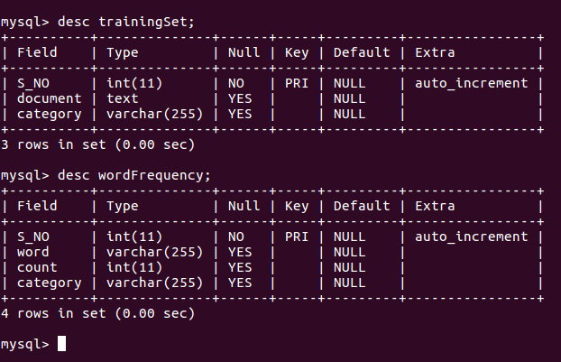

# Naive Bayes Classifier

Implementing Naive Bayes Classification algorithm into PHP to classify given text as ham or spam using MySql database.

### How to use
    
    <?php

        require_once('NaiveBayesClassifier.php');

        $classifier = new NaiveBayesClassifier();
        $spam = Category::$SPAM;
        $ham = Category::$HAM;

        $classifier -> train('Have a pleasurable stay! Get up to 30% off + Flat 20% Cashback on Oyo Room' . 
                ' bookings done via Paytm', $spam);
        $classifier -> train('Lets Talk Fashion! Get flat 40% Cashback on Backpacks, Watches, Perfumes,' .
                ' Sunglasses & more', $spam);

        $classifier -> train('Opportunity with Product firm for Fullstack | Backend | Frontend- Bangalore', $ham);
        $classifier -> train('Javascript Developer, Fullstack Developer in Bangalore- Urgent Requirement', $ham);

        $category = $classifier -> classify('Scan Paytm QR Code to Pay & Win 100% Cashback');
        echo $category; // spam
        
        $category = $classifier -> classify('Re: Applying for Fullstack Developer');
        echo $category; // ham

    ?>

### How to install the project-

1. Download the project and extract zip.
2. Create database in MySql-

    1. mysql> create database naiveBayes;
    2. mysql> use naiveBayes;
    3. mysql> create table trainingSet (S_NO integer primary key auto_increment, document text, category varchar(255));
    4. mysql> create table wordFrequency (S_NO integer primary key auto_increment, word varchar(255), count integer, category varchar(255));

3. Open a terminal and move to project folder
4. Edit database connection info in db_connect.php file
5. Execute main.php `php main.php`

### Database Schema
    
 

#### Blog
https://medium.com/@varunon9/classify-emails-into-ham-and-spam-using-naive-bayes-classifier-ffddd7faa1ef

##### For any bug/mistake you can create github issue. Contact varunon9@gmail.com for suggestion/query. 